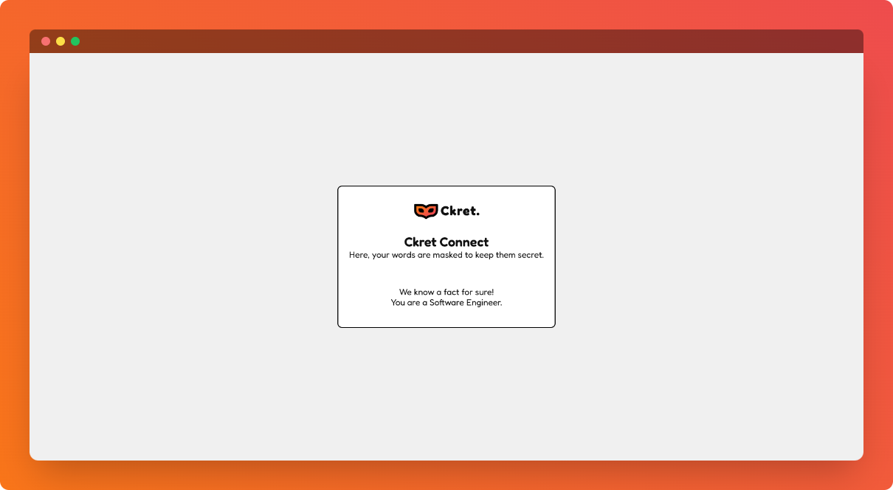

    

    <h1>Ckret Connect</h1>
    
Anonymous Messaging Platform - Backend

    
    
    

 

## ⚡ Introduction

Ckret Connect is the backend service for the [Ckret](https://ckret.xyz) App [(GitHub)](https://github.com/s4shibam/ckret).
Ckret is an anonymous messaging platform, where users can send and receive messages anonymously via link.

## ✨ Features

- Exchange messages with users anonymously
- Create account with gmail to get messages
- Customizable username, inbox status and feedback message
- Send secret messages using ckret link without even creating account

## ⚙️ Tech Stack

- Node JS
- Express JS
- MongoDB

## 📦 Other Libraries and Tools

- Mongoose
- JSON Web Token
- Winston
- ES Lint

## 🎯 Goals

- [x] Get cozy with `Node JS` for building strong backend systems.
- [x] Explore `Express JS` and its key elements: Router, Controller, and Middleware
- [x] Dive into `MongoDB` and ace querying techniques with `Mongoose` ODM
- [x] Create a custom error handler for smooth and consistent error management across all services

## 🖼️ Screenshots

## 👋🏻 Contact

